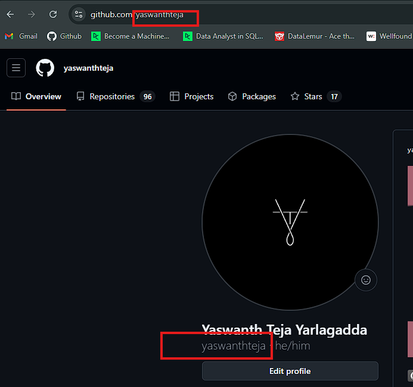

# Contribution Guidelines 📚

Welcome to our project! We appreciate your interest and contributions. Please read the following guidelines carefully to ensure a smooth collaboration.

## General Rules:

- **Creativity Allowed:** Feel free to submit pull requests that break the rules—we might just merge them anyway!
- **No Build Steps & Virtual Envs:** Avoid adding build steps like `npm install` to maintain simplicity as a static site.
- **Preserve Existing Content:** Do not remove existing content.
- **Code Style:** Your code can be neat, messy, simple, or complex. As long as it works, it's welcome.
- **Add Your Name:** Remember to add your name to the `contributorsList` file.
- **Keep it Small:** Aim for small pull requests to minimize merge conflicts and streamline reviews.

## Getting Started 🤩🤗


### Project Structuer
```

BegineerOpenSource-Hacktoberfest
   |
   |--Contributors_Website
      |--contributors
           |-contributorsList.js
   |--css
       |--animation.css
       |--contributors.css
       |--footer.css
       |--hacktoberfest.ico
       |--navbar.css
       |--style.css
   |--Scripts
       |-- main.js
       |--menu.js
       |--scroll.js
   |--index.html
   |--image
       |--CONTRIBUTING
       |--Contributors
   |--.gitignore
   |--CODE_OF_CONDUCT.md
   |--CONTRIBUTING.md
   |--Contributors.md
   |--LICENSE
   |--pull_request_template.md
   |--Programs
      |--Python
      |--Java
      |--C/C++
   |--README.md
   


```


### Using CommandLine 

 If you are looking to make your Open source first contribution for Hacktoberfest , follow the steps below.

#### If you don't have git install on your machine,
### - [Git](https://docs.github.com/en/get-started/quickstart/set-up-git)
#### If you don't have github create your profile
### -  [Github profile](https://github.com/signup?ref_cta=Sign+up&ref_loc=header+logged+out&ref_page=%2F&source=header-home)

- Now Connect your github to local machine by using these commands
- Now open your terminal or cmd and paste these commands

```

git config --global user.name "My userName"                
```
#### My userName ---> github username





```
git config --global user.email "youremailaddress@email.com"    
```
####  \youremailadress@email.com ---> your email used for github login

## 1. Project
- [BeginnerOpenSource-Hacktoberfest](https://github.com/yaswanthteja/BeginnerOpenSource-Hacktoberfest)


## 2. Fork this repository

Fork this repository by clicking on the fork button on the top of this page.
This will create a copy of this repository in your account.


## 3. Clone Your Fork:
   - Clone the forked repository to your local machine.

   


Now clone the forked repository to your machine. Go to your GitHub account, open the forked repository, click on the code button and then click the _copy to clipboard_ icon.

Open a terminal and run the following git command:

```bash
git clone "url you just copied"
```

where "url you just copied" (without the quotation marks) is the url to this repository (your fork of this project). See the previous steps to obtain the url.


For example:

```bash
git clone git@github.com:this-is-you/first-contributions.git
```

where `this-is-you` is your GitHub username. Here you're copying the contents of the first-contributions repository on GitHub to your computer.

## Create a branch

Change to the repository directory on your computer (if you are not already there):

```bash
cd  repositoryname
```

Now create a branch using the `git switch` command:

```bash
git switch -c your-new-branch-name
```

For example:

```bash
git switch -c add-project1
```

## Make necessary changes and commit those changes 

Now open `Contributors_Website\contributors\contributorslist.js` file in a text editor, add your name to it. Don't add it at the beginning or end of the file. Put it anywhere in between. Now, save the file.

- [Follow the the steps in Conributors.md](https://github.com/yaswanthteja/BeginnerOpenSource-Hacktoberfest/blob/main/Contributors.md)

## How to add Contributors??


- First Open the [file](https://github.com/yaswanthteja/BeginnerOpenSource-Hacktoberfest/blob/main/Contributors_Website/contributors/contributorsList.js)


- 1. First go to this file location
```
cd Contributors_Website/contributors/
```

- 2. Now open the contributorsList.js file and add your details


- Now copy the Following code and add the following details.
- Just follow the id number and Paste  below  as shown 

```
  {
    id: number,                            //add continuos numbers ex 1,2,3...
    fullname: "Enter your name ",          //add your full name
    username: "Your github link",          //add your github link
  },
```

example:- suppose already we have 11 members entered their details next id number should be 12 and so on

```
{
    id: 12,                            //add continuos numbers
    fullname: "Pavan ",          //add your full name
    username: "https://github.com/use",          //add your github link
  },

```


3. Now open Your terminal or cmd 
If you go to the project directory and execute the command `git status`, you'll see there are changes.


4. Add those changes to the branch you just created using the `git add` command:

```bash
git add Contributors.md
```

5. Now commit those changes using the `git commit` command:

```bash
git commit -m "Add your-name to Contributors list"
```

replacing `your-name` with your name.

## Push changes to GitHub

6. Push your changes using the command `git push`:

```bash
git push -u origin your-branch-name
```

replacing `your-branch-name` with the name of the branch you created earlier.

<details>
<summary> <strong>If you get any errors while pushing, click here:</strong> </summary>

- ### Authentication Error
     <pre>remote: Support for password authentication was removed on August 13, 2021. Please use a personal access token instead.
  remote: Please see https://github.blog/2020-12-15-token-authentication-requirements-for-git-operations/ for more information.
  fatal: Authentication failed for 'https://github.com/<your-username>/first-contributions.git/'</pre>
  Go to [GitHub's tutorial](https://docs.github.com/en/authentication/connecting-to-github-with-ssh/adding-a-new-ssh-key-to-your-github-account) on generating and configuring an SSH key to your account.

</details>

## Submit your changes for review

7. If you go to your repository on GitHub, you'll see a `Compare & pull request` button. Click on that button.


Now submit the pull request.


Soon I'll be merging all your changes into the main branch of this project. You will get a notification email once the changes have been merged.


Example: 

## Where to go from here?

Congrats! You just completed the standard _fork -> clone -> edit -> pull request_ workflow that you'll often encounter as a contributor!

1. Fork the repository and create a copy to your github

2. Clone the repository
```
git clone https://github.com/yaswanthteja/BeginnerOpenSource-Hacktoberfest.git
```


3. **Navigate to the Project Directory:**

   ```bash
   cd BeginnerOpenSource-Hacktoberfest
   ```

4. **Create a New Branch:**

   ```bash
   git checkout -b my-new-branch
   ```
   

5. **Make Your Changes:**
```
cd contributors/
```
   - Add your name to `contributors/contributorsList.js` and make any other contributions.

   ```bash
   git add .
   ```

6. **Commit Your Changes:**

   ```bash
   git commit -m "Relevant message"
   ```

7. **Push to Your Branch:**

   ```bash
   git push origin my-new-branch
   ```

8. **Create a Pull Request:**
   - Go to your forked repository on GitHub and create a pull request to the main repository.

## Avoiding Conflicts {Syncing Your Fork}

To keep your fork up-to-date with the main repository and avoid conflicts:

1. **Add Upstream Remote:**

   ```bash
   git remote add upstream https://github.com/yaswanthteja/BeginnerOpenSource-Hacktoberfest
   ```

2. **Verify the New Remote:**

   ```bash
   git remote -v
   ```

3. **Sync Your Fork with Upstream:**

   ```bash
   git fetch upstream
   git merge upstream/main
   ```

   This will pull in changes from the parent repository and help you resolve any conflicts.

4. **Keep Updated:**
   - Regularly pull changes from the upstream repository to keep your fork updated.

We look forward to your contributions and thank you for being a part of our community!


