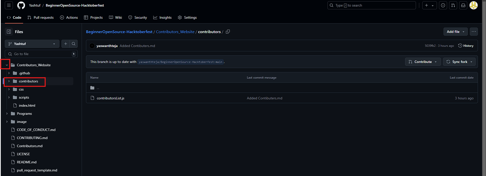

### Steps to Add Contributors

If you have done it before skip these and directly jump to How to add contributors.
- Star the project


- Fork this repo 


- click on create fork


- After creating the fork you will see like this


- now Click here to create new branch


- Now click on new branch


- Now  give the new branch name as you like prefer use your username as branch name and click on create new branch.


- Now we can see the branch names and you can find your branch name here


- Now we need to go back to the project which is in your github. click here you can find your branch name here


- click on your branch name now you can find that there is change in branch name instead of main you can find your branch name here.


- so now we are ready to make changes in your project. And make sure any changes you are making in the project should be done in your branch only.


- Now before we make any changes in our project we should check these two things 
     - first check the branch name is it our's or not,if it's not our branch we need to change the branch.
     - we need check that our branch is doesn't have commits behind the main(repository owner branch)
     - if we found that any commit's behind like in the picture just click on sync fork.


- You can click on the comapre  or you can click on the update branch directly it will change to lastest commit on the branch.


- First pull request 


- first click on the Contributors_website

- Next It will Change like this 


- Now Click on the contributors



- Now open the contributersList.js and copy the code from here


- Now click on the pencil symbol to edit the file.


- Before editing the file


- After Editing,like this you need add id numbers and details


- click on commit changes


- click on commit changes


- Now go back to your github repository make sure you are in your branch where you find like this comapare and pull request


- click on that compare and pull request and click on create pull request


- here like this your pull request sent successfully now once we will  acept that pull request


 
-  For maintainer he will recive like this when ever he accepts and merges the pull request


-It will look like this which is maintainer duty to merge 


- After successfull pr/merge you can find 1 commit back so we need to sync fork and start next Pull request.


2. Now we create 2nd pull request for the Programs 
click on the programs and select the programming language we need to add programs


- here i'm selecting the python ,now click on the add file


- Here you can create or upload file 


 - here i select the create new file option

- and add name.py here i choose factorial.py and commit changes
 

 -Now we succesfully created another pull request

  

- Now we can see 1 commit behit now click  on the contibute button


- click on open pull request


- Now click on create pull request


- Now we successfull  sent and completed pr/merge request

3. Now 3rd pull request

- now we can complete this by using upload file 

- first go programs and in programs select any language for this i'm selecting python
- Click on the Add file and select upload file


- Now we can add file or drang and drop file next click on commit changes


-here file uploaded successfully


now click on contribute ->open pullrequest->create pull request 
- next sync fork the branch and do the remaing pull requests


### CLI commands

- Clone it on your local machine

```terminal
git clone https://github.com/yaswanthteja/BeginnerOpenSource-Hacktoberfest.git
```

- Navigate to the project directory.

```terminal
cd BeginnerOpenSource-Hacktoberfest
```

- Create a new branch

```markdown
git checkout -b my-new-branch
```

<!--- - Add your name to `contributors/contributorsList.js`. -->

```markdown
git add .
```

- Commit your changes.

```markdown
git commit -m "Relevant message"
```

- Then push

```markdown
git push origin my-new-branch
```

- Create a new pull request from your forked repository

<br>

## Avoid Conflicts {Syncing your fork}

An easy way to avoid conflicts is to add an 'upstream' for your git repo, as other PRs may be merged while you're working on your branch/fork.   

```terminal
git remote add upstream https://github.com/yaswanthteja/BeginnerOpenSource-Hacktoberfest
```

You can verify that the new remote has been added by typing:

```terminal
git remote -v
```

To pull any new changes from your parent repo, simply run:

```terminal
git merge upstream/main
```

This will give you any eventual conflicts and allow you to easily solve them in your repo. It's a good idea to use it frequently in between your own commits to make sure that your repo is up to date with its parent.

For more information on syncing forks, [read this article from GitHub](https://help.github.com/articles/syncing-a-fork/).


### Example


## How to add Contributors??


- First Open the [file](https://github.com/yaswanthteja/BeginnerOpenSource-Hacktoberfest/blob/main/Contributors_Website/contributors/contributorsList.js)


Congrats! You just completed the standard _fork -> clone -> edit -> pull request_ workflow that you'll often encounter as a contributor!

1. Fork the repository and create a copy to your github

2. Clone the repository
```
git clone https://github.com/yaswanthteja/BeginnerOpenSource-Hacktoberfest.git
```


3. **Navigate to the Project Directory:**

   ```bash
   cd BeginnerOpenSource-Hacktoberfest
   ```

4. **Create a New Branch:**

   ```bash
   git checkout -b my-new-branch
   ```
   

5. **Make Your Changes:**
```
cd contributors/
```
   - Add your name to `contributors/contributorsList.js` and make any other contributions.


now open the contributorsList.js file and edit and add the details


- Now copy the Following code and add the following details.
- Just follow the id number and Paste  below  as shown 

```
  {
    id: number,                            //add continuos numbers ex 1,2,3...
    fullname: "Enter your name ",          //add your full name
    username: "Your github link",          //add your github link
  },
```

example:- suppose already we have 11 members entered their details next id number should be 12 and so on

```
{
    id: 12,                            //add continuos numbers
    fullname: "Pavan ",          //add your full name
    username: "https://github.com/use",          //add your github link
  },

```


   ```bash
   git add .
   ```

6. **Commit Your Changes:**

   ```bash
   git commit -m "Relevant message"
   ```

7. **Push to Your Branch:**

   ```bash
   git push origin my-new-branch
   ```

8. **Create a Pull Request:**
   - Go to your forked repository on GitHub and create a pull request to the main repository.

## Avoiding Conflicts {Syncing Your Fork}

To keep your fork up-to-date with the main repository and avoid conflicts:

1. **Add Upstream Remote:**

   ```bash
   git remote add upstream https://github.com/yaswanthteja/BeginnerOpenSource-Hacktoberfest
   ```

2. **Verify the New Remote:**

   ```bash
   git remote -v
   ```

3. **Sync Your Fork with Upstream:**

   ```bash
   git fetch upstream
   git merge upstream/main
   ```

   This will pull in changes from the parent repository and help you resolve any conflicts.

4. **Keep Updated:**
   - Regularly pull changes from the upstream repository to keep your fork updated.

